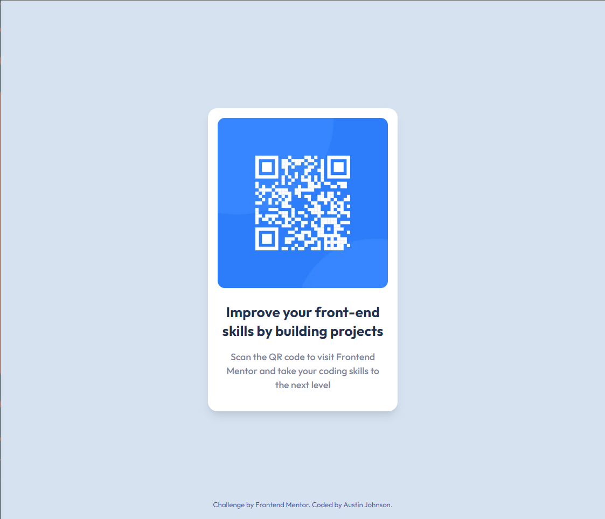

# Frontend Mentor - QR code component solution

This is a solution to the [QR code component challenge on Frontend Mentor](https://www.frontendmentor.io/challenges/qr-code-component-iux_sIO_H). Frontend Mentor challenges help you improve your coding skills by building realistic projects.

## Table of contents

- [Overview](#overview)
  - [Screenshot](#screenshot)
  - [Links](#links)
- [My process](#my-process)
  - [Built with](#built-with)
  - [What I learned](#what-i-learned)
  - [Continued development](#continued-development)
  - [Useful resources](#useful-resources)
- [Author](#author)
- [Acknowledgments](#acknowledgments)

## Overview

### Screenshot



### Links

- Solution URL: [https://frontend-mentor-qr-code-kappa.vercel.app/](https://frontend-mentor-qr-code-kappa.vercel.app/)

## My process

Creating this relatively simple QR Component was a process of identifying installing and implementing Next.js and Tailwind to use a custom theme and font colors. Next, I implmeneted the necessary front end HTML elements and styled them using their appropriate Tailwind classes. The ultimate goal was to have the font sizing, layouts, paddings, margins, etc. mimick the given design file.

### Built with

- [React](https://reactjs.org/) - JS library
- [Next.js](https://nextjs.org/) - React framework
- [Tailwind](https://https://tailwindcss.com/) - For styles

### What I learned

While I've had plenty of experience copying existing Tailwind classes, I've been relativley weak in implementing them on my own from scratch. This exercise helped me become more familiar with key Tailwind classes, such as flex boxes and custom colors.

One challenge was creating a footer element that is displayed at the bottom of the user's screen. I was able to accomplish this using the following pattern of Tailwind classes.

```js
<main className='bg-light-gray relative h-screen'>
  <div className='absolute inset-0 flex flex-col items-center justify-center'>
    // Main Page Content
    <footer className='absolute inset-x-0 bottom-0 text-center mb-4'>
      <p className='text-xs text-accent-blue'>// Footer Content</p>
    </footer>
  </div>
</main>
```

### Continued development

My goal with Frontend Mentor is to continue to familiarize myself with Tailwind classes such that I can read other people's code, as well as design my own components from scratch.

### Useful resources

- [Tailwind Docs](https://tailwindcss.com/docs/installation) - This is the most helpful resource to learn Tailwind classes.

## Author

- Website - [Austin Johnson](https://www.austinjohnson.me)
- Frontend Mentor - [@AgenticAI](https://www.frontendmentor.io/profile/AgenticAI)
- Twitter - [@AustonianAI](https://twitter.com/AustonianAI)
